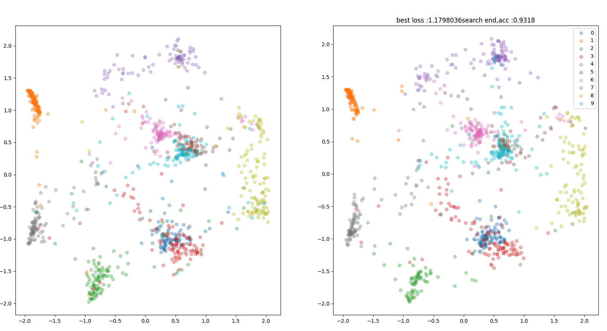

[Keras]MODALS: Modality-agnostic Autometed Daa Augmentation in the Latent Sapce
----

## Usage
```
$ python run_iris.py
$ python run_cifar10.py
$ python run_mnist.py
```

## Result
<div align="center">
  <p>
    
  </p>
  <p>Result of sample 1000 in MNIST dataset of latent vector</p>
</div>
- Right : train data sample 1000    
- left : test data sample 1000   

|dataset|best accuracy|
|:------|------------:|
|IRIS(s)|1000%|
|MNIST|93%|
|CIFAR10| 70%|

## Reference
[1] Tsz-Him Cheung, Dit-Yan Yeung. <a href="https://openreview.net/forum?id=XjYgR6gbCEc">MODALS: Modality-agnostic Automated Data Augmentation in the Latent Space</a>. ICLR, 2021.  
[2] Danie Ho. <a href="https://arxiv.org/abs/1905.05393">Population Based Augmentation: Efficient Learning of Augmentation Policy Schedules</a>. ICML, 2019.